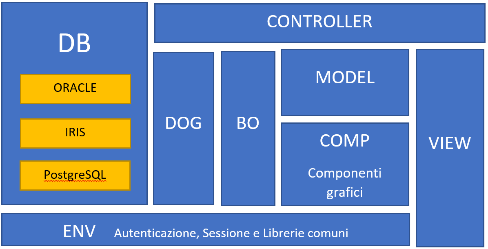
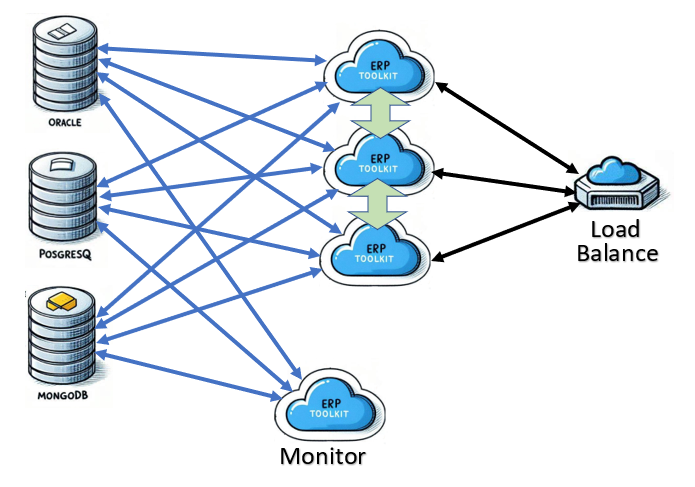
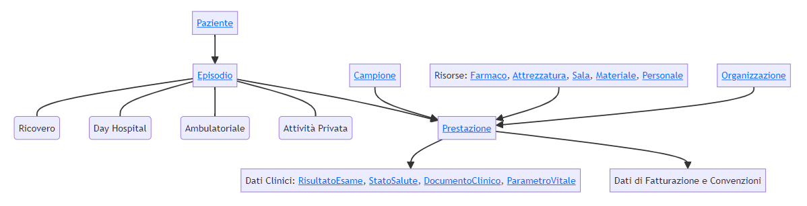

# ErpToolkit

L'obiettivo del progetto è costruire una piattaforma di supporto per la creazione, gestione e monitoraggio di semplici ERP (Enterprise Resource Planning). La struttura del software si compone di:

1. **Server Web** (ASP.NET Core 8) per la visualizzazione dell'interfaccia grafica basata su architettura MVC (Model-View-Controller), che separa logicamente struttura, visualizzazione e gestione dei dati.
2. **Scheduler programmabile** per l'esecuzione temporizzata di attività.
3. **Listener** per l'esposizione di servizi SOAP, REST, ecc.

I tre moduli condividono una libreria che espone le seguenti funzionalità.

- **COMP:** Componenti grafici per facilitare la creazione delle pagine web: Autocomplete, Calendario, Tabella, ecc.
- **DB:** Moduli di accesso a diversi database e normalizzazione dei dati: SQL Server, ORACLE, IRIS, MongoDB, PostgreSQL, ecc.
- **DOG:** Funzionalità di archiviazione controllata dei dati per la generazione dei contatori, la gestione delle transazioni, l'audit delle attività e i processi di allineamento asincrono da DB.
- **BO:** Business Objects per la verifica dei dati e la governance delle transazioni complesse su DB.
- **ENV:** Sistema di autenticazione e profilazione utente, con gestione delle variabili di sessione.

La logica di programmazione del progetto risiede nei file:

- **Model:** struttura dati e proprietà dei campi del modello,
- **Controller:** accesso alla base di dati ed elaborazioni funzionali,
- **View:** usato esclusivamente per formalizzare disposizione grafica dei componenti nella pagina.

Il modello tecnologico prevede l'uso di un servizio Windows o di un processo in background Linux con scalabilità su più macchine in load-balancing, collaborazione tra i processi e monitoraggio centralizzato.

# Storyboard

Per ogni oggetto del modello si prevede una vista standard composta da:

1. Una o più barre di stato contenenti una sintesi delle proprietà già selezionate con cui si chiama la pagina (es: paziente, episodio, richiesta, ecc.).
2. Un filtro di selezione che consente di raffinare la ricerca in base all'impostazione di parametri.
3. Una tabella contenente i record selezionati in base al profilo di accesso, alle proprietà di chiamata della pagina e alle proprietà impostate nel filtro.
4. Per ogni riga sono previste finestre modali di visualizzazione, aggiornamento e cancellazione del contenuto informativo.
5. Le celle della tabella possono contenere link che consentono di proseguire nel percorso o di aprire una nuova finestra di dettaglio.
6. Il pulsante "Add" in testa alla tabella consente di aggiungere un nuovo record alla tabella.

Il menù della form consente di accedere direttamente a una vista del modello, o di programmare un percorso logico tra le viste aggiungendo di volta in volta nuovi parametri di selezione da applicare alle form successive. Ogni percorso può prevedere vincoli programmabili che impediscono di finalizzare l'obiettivo se mancano alcune informazioni necessarie. Le stesse form possono essere incluse in diversi percorsi, con diversi vincoli di percorribilità e diversi parametri di ingresso. Si può prevedere l'uso di form più complesse che operano contemporaneamente su diversi oggetti, appoggiandosi eventualmente alle funzionalità di un Business Object.

# Use Case

Come Use Case consideriamo il modello dati di un **ERP sanitario**, di cui proponiamo una semplice rappresentazione a puro titolo esemplificativo.

Al centro del processo è presente il paziente, che viene anagrafato e contestualizzato nel territorio. Ogni suo contatto con la struttura ospedaliera genera un episodio, che può caratterizzarsi in ricovero, day hospital, ambulatoriale o in attività privata. Nel corso dell'episodio, per il paziente vengono effettuate un certo numero di prestazioni, eventualmente raggruppate in una richiesta. L'esecuzione di una prestazione può prevedere il prelievo di un campione e l'uso di diverse risorse, quali: materiali, farmaci, personale sanitario, sale operatorie, ecc. Durante il ciclo di esecuzione della prestazione il paziente è gestito da diversi utenti (amministrativi, sanitari, infermieristici) ed è alternativamente sotto la responsabilità di diverse unità di cura (centri di prenotazione, reparti, centri di erogazione prestazione, ecc.), che fanno tutti parte dell'organizzazione ospedaliera. L'esecuzione di una prestazione produce dei dati clinici, tra cui: parametri vitali, risultati di esami, documenti clinici, ecc., che vanno archiviati e distribuiti. L'erogazione del servizio prevede una gestione di cassa (contabile) per la fatturazione delle prestazioni ed i rimborsi regionali. L'uso delle risorse prevede una gestione di magazzino ed amministrativa del personale.

## Business Objects ERP sanitario

Per questo esempio sono previsti due BO:

**ADT** - flusso di Accettazione, Dimissione, Trasferimento paziente.
**Ciclo Atto** - flusso di richiesta-erogazione di una prestazione.

## Percorsi ERP sanitario

- Nuova Lista d'attesa: ListaPaziente + Inserimento in lista d'attesa.
- Accettazione: ListaPaziente + Recupero Lista d'attesa + Accettazione e assegnazione letto.
- Dimissione: ListaPaziente + ListaEpisodio + Dimissione e compilazione SDO.
- Trasferimento: ListaPaziente + ListaEpisodio + Trasferimento.
- Richiesta: ListaPaziente + ListaEpisodio + Inserimento Richiesta.

. . . . . .

